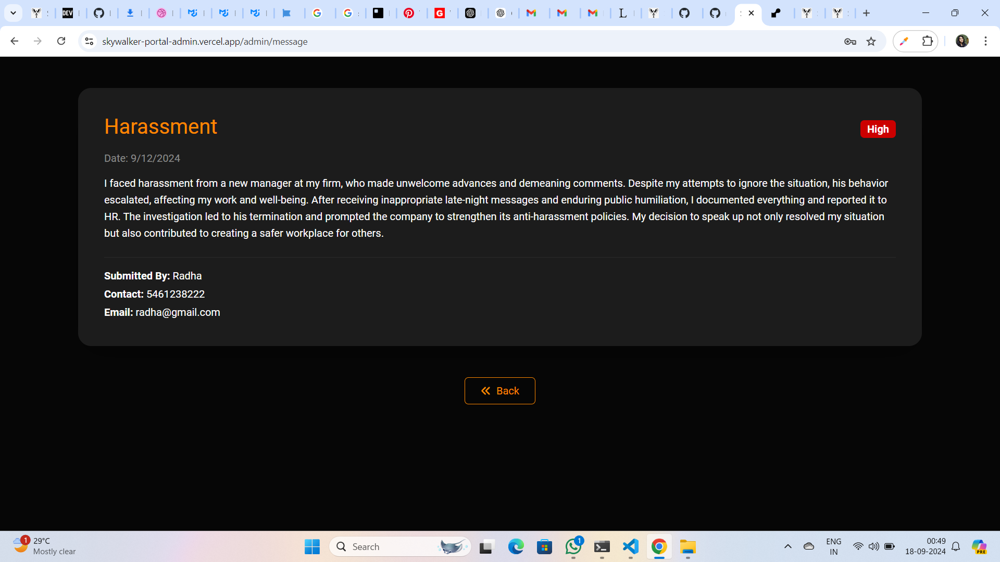

## Skywalker Portal - Admin Panel
The Skywalker Portal Admin Panel is a dedicated dashboard for the legendary superhero Alden Skywalker to manage and resolve grievances submitted by users. The admin can view user complaints, view analytics, and manage the overall system efficiently using this panel.

## Table of Contents
- [Overview](#overview)
- [Features](#features)
- [Functionality](#functionality)
- [Installation](#installation)
- [Code Structure](#code-structure)
- [External Libraries](#external-libraries)
- [Screenshots](#screenshots)

## Overview
The Skywalker Portal Admin Panel is a full-stack MERN (MongoDB, Express, React, Node.js) application designed for handling grievances submitted by users of the Skywalker Portal. The admin panel features a modern dashboard, data analytics via charts, and the ability to manage grievances efficiently.

- The app is built using the following tech stack:

  - **MongoDB**: To store user grievances and admin data.
  - **Express.js**: To manage backend API routes.
  - **React.js**: For building the user interface.
  - **Node.js**: To handle the backend server logic.

## Features

 - **Grievance Management**: View,delete & analize submitted grievances.
 - **Charts and Analytics**: Track grievances and view system data through visual charts.
 - **Admin Dashboard**: View grievances in real-time and manage user requests.
 - **Dynamic UI**: Sleek and modern interface with smooth transitions for a better user experience.

## Functionality
1. Login
 - Admin can securely login to dashboard with email & password
2. Dashboard Analytics
 - Visual data is displayed using charts, showing the number of grievances submitted and its priority based classificaion
3. Management of complaints
 - Admin can view,read,search,filter and delete the grievances  


## Installation

1. Clone the repository
   ```bash
   git clone https://github.com/reshmaps156/skywalker-portal-frontend.git
2. Install the required dependencies
   ```bash
   npm install
3. Start the application
   ```bash
   npm run dev


## Code Structure   

```bash
/src
├── /assets                    # Images
├── /components                
│   ├── Barchart.jsx           # Barchart component
│   ├── Inbox.jsx              # Inbox to display all grievances 
│   ├── Overview.jsx           # Default section in adminpanel 
│   ├── Piechart.jsx           # Piechart 
│   ├── SideNav.jsx            # Sidebar to navigate 
├── /pages
│   ├── Adminpanel.jsx         # Admin's dashboard
│   ├── home.css               # stylesheet for Home/login page
│   ├── Home.jsx               # Home page where admin can login
│   ├── Message.jsx            # single messages are displaying here
├── /services
│   ├── api.js                 # API calls
│   ├── commonApi.js           # Axios configuration  
│   ├── serverURL.js           # server URL 
├── /utils
│   ├── Datashare.jsx          # Context Api
│   ├── ProtectedRoutes.jsx    # Path protection
├── App.jsx                    # Main app component handling routes          
├── bootstrap.min.css          # Bootstrap styling  
├── index.css                  # General styling for the app 
├── main.jsx                   # Application entry point
```
## External Libraries

  - Bootstrap 
  - React Bootstrap
  - Mui Material
  - Mui/x-charts
  - FontAwesome
  - Axios
  - React toastify
  - React Router DOM
  - React Pro Sidebar

## Screen shots  
  


  
